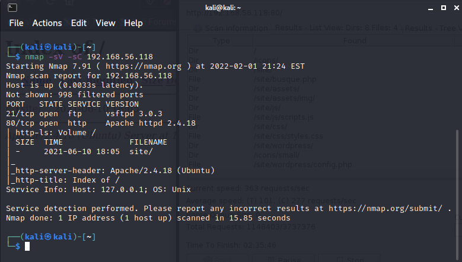
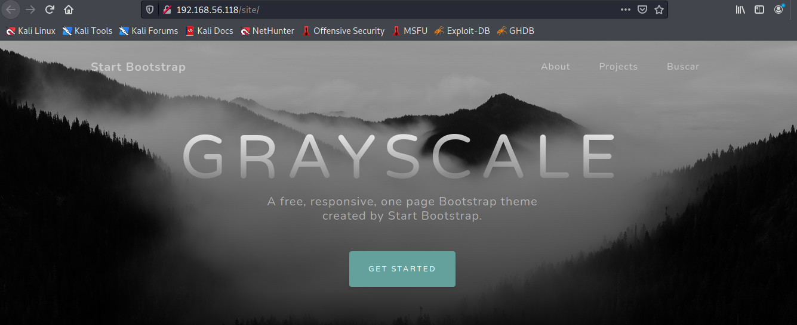
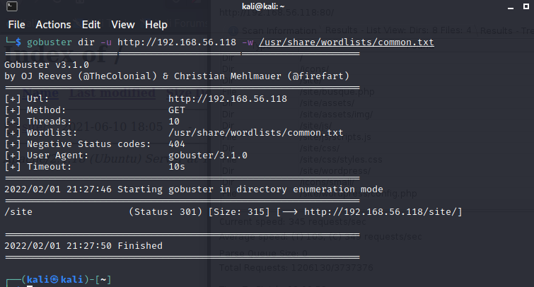
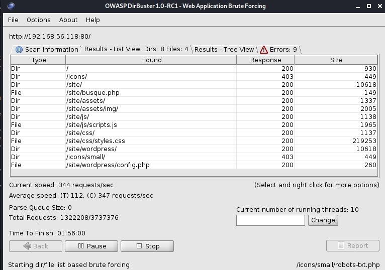
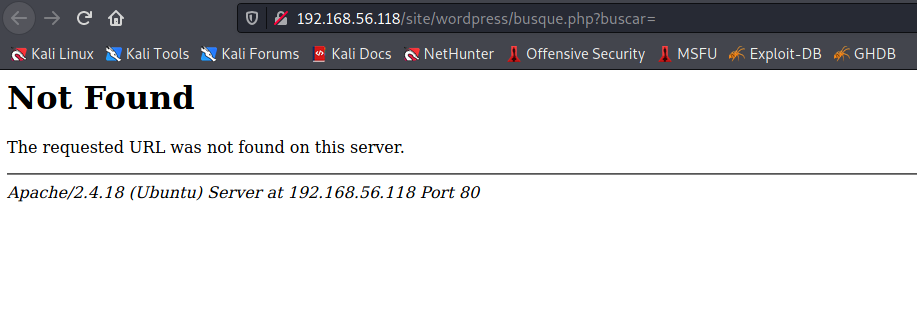
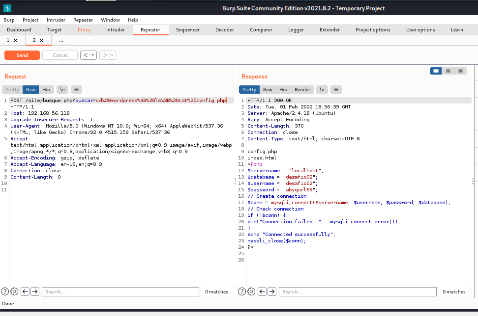
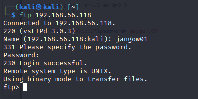
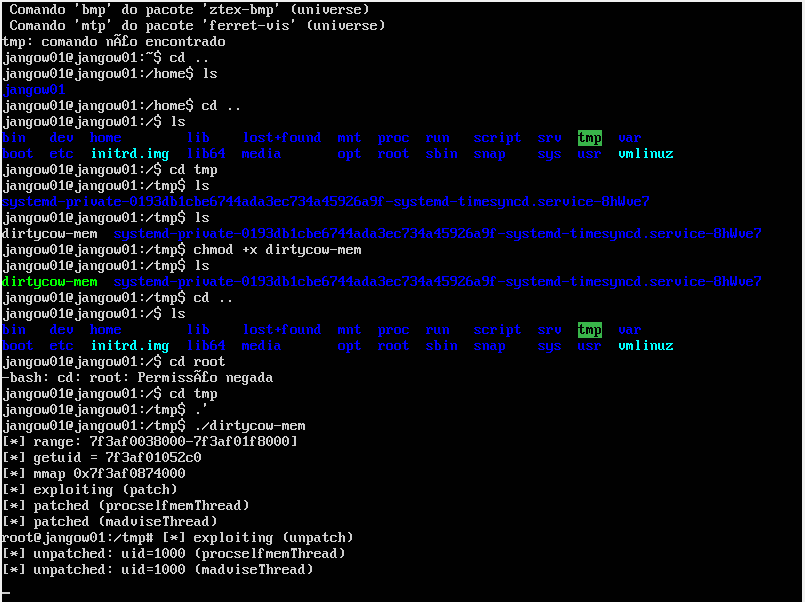
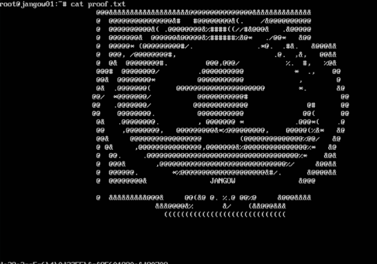

# VulnHub - JANGOW

## Introduction
In this documentation I am going to go through the steps that I took to enumerate the given virtual machine, gain access to the machine, and gain root access. 

## Process

### Step 1. Nmap Scans
The first thing that I did was run an nmap scan on the IP address of the virutal machine that was given. This nmap scan would show us what ports were open and which services were running on the VM. Knowing these things will provide us with the information necessary to know how we can find and exploit vulnerabilites relating to those ports and services. 

The nmap commmand I ran was ```nmap -sV -sC 192.168.56.118```. Below is the result of the nmap scan: 


**Figure 1. Nmap Scan**


From this scan, we see that the machine is running FTP on port 21 and an Apache web server on port 80. 
I tried logging into the FTP server with credentials such as 'root', 'admin', etc. but that didn't work. I decided to instead look at port 80. 

### Step 2. Gobuster and Dirbuster
In a web browser, I went to http://192.168.56.118 to see what was being hosted on the web server. Below is the website that it directed to. 


**Figure 2. Website**

To find out what other endpoints I could visit on this web server, I used the tools Gobuster and Dirbuster. 
I first used Gobuster with this command:   
```gobuster dir -u http://192.168.56.118/ -w /usr/share/wordlists/common.txt```.


**Figure 3. Gobuster**

 The results of this Gobuster command mostly showed us what we already knew, that http://192.168.56.118 redirected to http://192.168.56.118/site/. After running Gobuster, I decided to try Dirbuster. I ran ```dirbuster http://192.168.56.118``` which then popped up the dirbuster GUI. I selected the medium-2.3-top1million wordlist and hit start. Dirbuster was able to find more files and directories hosted on the webserver. 
 
 
**Figure 4. Dirbuster**

 I started visiting and investigating the different files listed in Dirbuster. I found one page that had a link for the busque.php page with a query parameter: http://192.168.56.118/site/busque.php?buscar=

 
**Figure 5. Busacar**

### Step 3. BurpSuite
After poking around the different files in a web browser, I opened up BurpSuite to further investigate the HTTP requests and responses. I turned the intercept on and in the BurpSuite browser went to http://192.168.56.118/site/busque.php?buscar=. I then opened the request in the repeater. 

In the repeater, I was able to modify the HTTP request and view the different responses. In this request, if you set different linux commands to the ```buscar``` query in the URL, these linux commands would be executed on the server. Below is an example of running ls in this manner: 

 
**Figure 6. ls command**

Using this, I was able to redirect to the /home folder and found the folder for user jangow01. Inside of this user's folder was a user.txt file that contained an MD5 hash. 

Further investigation showed that the file located at http://192.168.56.118/site/wordpress/config.php contained a username and password. 


     
**Figure 7. Config.php**

### Step 4. Logging In & Privilege Escalation
After finding this, I tried using it to log onto the FTP server. I tried using the ```desafio02``` username but soon found that the username that was meant to be used was ```jangow01``` with the password ```abygurl69```.
After logging into the FTP server, I found that I needed to run the command ```pass``` in order to run any other commands successfully. 


 
**Figure 8. FTP Login**

After getting onto the FTP server, I used the same commands to log onto the Virtual Machine. The next step was gaining root privilege. In order to do this, I used the [Dirtycow Exploit](https://www.hackingarticles.in/hack-linux-kernel-using-dirtycow-exploit-privilege-escalation/#:~:text=DirtyCow%20is%20the%20latest%20exploit,breakage%20which%20contains%20private%20ROM.). 

The first step to use this exploit is downloading the Dirtycow file onto my Kali VM using the ```wget``` command. 

After doing that, I logged back into the FTP server and used the ```put``` command to copy that Dirtycow file onto the FTP server. I copied it into the /tmp folder. Once copying it over, I went back to the Jangow VM and proceeded to execute the Dirtycow file with this command: ```./dirtycow-mem```. To verify that it worked, I went to the root folder where a file called proof.txt should have been created. Running ```cat proof.txt``` showed that the Dirtycow exploit worked and the user had root access. 

 
**Figure 9. Dirtycow**

 
**Figure 10. Access Granted**
